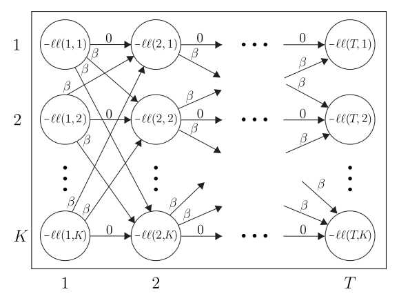

主要参考：[知乎](https://zhuanlan.zhihu.com/p/459773743)
# problem setup
考虑一个长度为T，特征数目为n的原始时间序列\
  

我们的目标是将上述T个观测值聚为K个类。往常有许多时序聚类的工作，这些工作操作的数据最小粒度为单个时间戳，如上图中的$x_i$，本文与寻常的时序聚类工作有所不同，本文用于聚类的最小数据粒度不是单一的时间戳，而是同时考虑每个时间戳和他们的前驱。
本文定义一个时间窗口，大小为$\omega<<T$，将$x_i$及之前的$\omega-1$个时间戳拼接成一个向量
$X_i=[x_{i-\omega+1,...,x_i}]^T$
  
这样有个问题是对于前$\omega-1$个时间戳，它们对应的窗口所包含的时间戳会不足$\omega$个，论文中给出的解决办法是简单地仅取一个短的子序列.在代码实现中，每个窗口包含$x_i$和$x_i$的$\omega-1$个后继，然后最后时间戳不足的部分填0.

# 多元高斯分布
$$
f(x)=\frac{1}{\sqrt{2\pi}^n*det(\sum)^\frac{1}{2}}*e^{-\frac{(X-\mu_{X})^T*\sum^{-1}*(X-\mu_X)}{2}}
$$
其中，$\sum$代表多元高斯分布变量X的协方差矩阵，当X的不同特征相关时，$\sum$为不同特征之间的协方差值
$$
\begin{matrix}
\end{matrix}
$$
  

# Toeplitz矩阵
  

时序不变性的假设：对于同一个簇中的所有时间戳，固定顺序时间戳的依赖关系是相同的。\

本文用一个Toeplitz矩阵作为多元高斯分布中的逆协方差矩阵，来定义每个簇的依赖关系。维度nw=长度为w的时间窗口*序列特征数n。比如对于某个簇中的$X=[x_1,...x_w]\in R^{nw}$，其特征的协方差矩阵中$Cov(x_2,x_1)$位置的值就代表了$x_1$与$x_2$的依赖关系，体现在Toeplitz矩阵中就是第一列的子矩阵$A^{(1)}$代表了$x_1$与$x_2$的依赖关系，$A^{(1)}$中的元素${A^{(1)}}_{ij}$代表了$x_1$的第i个特征与$x_2$的第j个特征的依赖关系。\

而使用Toeplitz矩阵的原因是所有与对角线平行的线上为同一子矩阵，第二列的$A^{(1)}$就代表了
$x_2$与$x_3$的依赖关系。这就体现了时序不变性。

# 问题建模
求解的目标有两个:
1. K个簇的逆协方差矩阵$\theta=\{\theta_1,...,\theta_K\}$
2. K个簇的分配集$P$={$P_1$,...,$P_K$}, 其中$P_i$是{1,2,...,T}的一个子集
   
最优化问题:

  
1. $||\lambda\circ\theta_i||_1$为L1正则化项，目的是得到稀疏的Toeplitz矩阵
[L1正则化和L2正则化的理解](https://blog.csdn.net/jinping_shi/article/details/52433975)
2. $ll(X_t,\theta_i)$为多元高斯分布的对数似然，对多元高斯分布的f(x)取对数，可以推导出
 
3. temporal consistency项为时序一致项，当$X_t$和$X_{t-1}$属于不同的簇时取1，属于同一个簇时取0，相当于相邻的两个时间戳如果分配到不同的簇中就在loss中增加一个大小为$\beta$的惩罚项

# 问题求解
使用EM算法的一个变体来交替地求解问题(1)中的参数，直到簇分配收敛
1. 将每个窗口X分配给簇
2. 更新参数$\theta$

## 窗口分配
分配X时固定参数$\theta$，此时问题(1)中的sparsity项大小不变，问题(1)变为
  

问题(3)求解可以通过动态规划来求解，等价于使用[维特比算法](https://www.zhihu.com/question/20136144)求下图中从左到右的最短路径，

  
## 更新参数
  

# ADMM交替乘子法
[知乎](https://zhuanlan.zhihu.com/p/332243047)