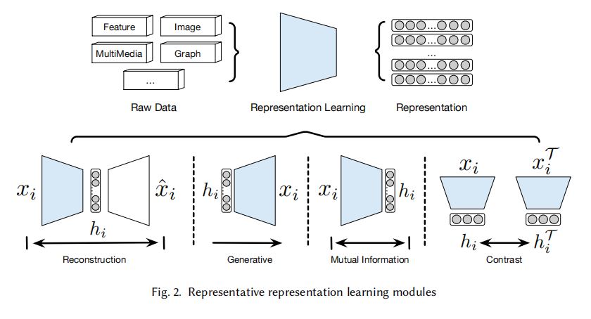

# 综述论文
A Comprehensive Survey on Deep Clustering: Taxonomy, Challenges, and Future Directions，Submitted on 15 Jun 2022

## 对聚类问题的分类

**deep clustering**:借助深度神经网络来对高维表示进行聚类，不仅仅是简单地将网络输出的表示进行聚类

**shallow clustering**：直接对原始数据聚类

**hard clustering**：输出为每个样本属于哪个簇

**soft clustering**：输出为每个样本属于各个簇的概率

**partitioning cluster**：每个样本只属于一个簇

**overlapping clustering**：每个样本可能属于多个簇

## representation learning module
这部分介绍deep cluster中用到的表示学习模块

  

1. **Auto-Encoder representation learning**
   
   auto-encoder就是两个深度神经网络的线性堆叠，分别称作encoder和decoder。encoder把输入样本编码为低维表示，deocder把低维表示还原为输入样本。优化目标通常是输入与输出之间的均方误差。

   优点：易于实现

   缺点：学习得到的表示仅代表单独的一个样本，样本间的关系被完全忽视

2. **deep generative representation learning**
   
3. **mutual infomation maximization representation learning**
4. **contrastive representation learning**
5. **cluster friendly representation learning**
   
   K-means friendly：希望样本的表示能聚集在簇中心的表示附近

   spectral cluster friendly：

   cluster friendly的方法因为直接通过聚类的结果进行优化，可能极大地提升聚类的表现，

   Currently, the
   research community has put more efforts on the inspirations of clustering methods and express
   them in a deep learning perspective, rather than learning specific representations for each clustering method.这段话的意思是说主流的研究不希望单独为每种聚类方法开发一种表示的学习，而是希望深度神经网络学习的表示可以适用于各种聚类方法？

6. **subspace representation learning**
   

